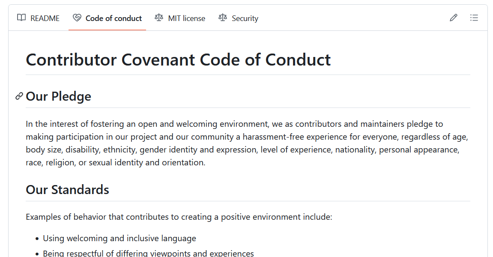

# Contribution files

While not directly related to the build system, these files will improve the
collaboration in your project. Consider adding them:

- `README.md`: include at least the main features, screenshots, getting started
  or links to documentation and build & release instructions.
- `LICENSE`: information about the license. Check
  [choose a license](https://choosealicense.com/).
- [`SECURITY.md`](https://github.com/pleonex/template-csharp/blob/main/SECURITY.md):
  information how to report vulnerabilities properly.
- Community:
  - [`CONTRIBUTING.md`](https://github.com/pleonex/template-csharp/blob/main/CONTRIBUTING.md):
    explain how to create issues and pull requests.
  - `CODE_OF_CONDUCT.md`: GitHub can help to create it.
- IDE support:
  - [`.editorconfig`](https://github.com/pleonex/template-csharp/blob/main/.editorconfig):
    code styles and code warnings.
  - [`.vscode/`](https://github.com/pleonex/template-csharp/tree/main/.vscode):
    VS Code support to build, run and debug the project.
- GitHub issues / PR:
  - [`.github/ISSUE_TEMPLATE/`](https://github.com/pleonex/template-csharp/tree/main/.github/ISSUE_TEMPLATE):
    templates to create GitHub feature requests and bug reports.
  - [`.github/PULL_REQUEST_TEMPLATE.md`](https://github.com/pleonex/template-csharp/blob/main/.github/pull_request_template.md):
    Pull Request template.

