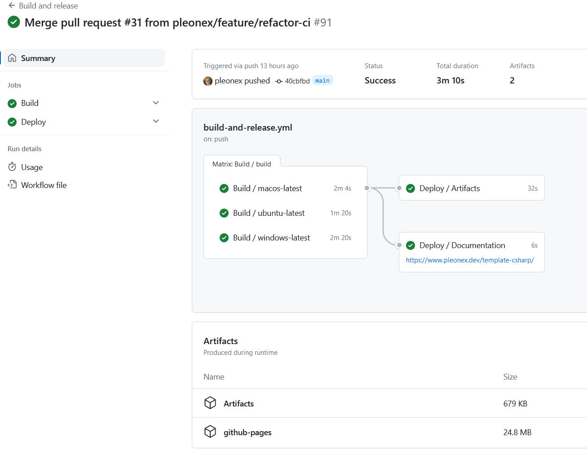

# Setup guide

**_Welcome to PleOps.Cake! 🎉_**

We will cover how to integrate a full featured DevOps workflow into your .NET
projects. This includes:

- 🔧 .NET project building, testing and publishing to NuGet feeds
- 📃 Documentation project building and publishing to GitHub Pages
- 📦 Dependency management
- 📉 Git workflow for features, patches and releases
- 🆕 Versioning and release management
- 🤖 Continuous Integration (CI) pipelines
- 🏠 Local development environment and IDEs

At the end of this guide you will have a project ready to release with a
continuous integration system like GitHub Actions.



The guide will start explaining how to create the
[build system project](#build-system-project), then we will configure your
[.NET projects](./tutorial-projects-net.md) and a
[documentation page](./tutorial-docs.md). It continues
[setting up continuous integration](./tutorial-ci.md) and it ends with some
optional but recommended [collaboration files](./tutorial-collaboration.md).

To understand how the build system works, the workflow and tasks
[check-out the workflow](../workflows/pipeline.md) page.

Prepare your self a good cup of 🍵 or ☕ and let's dive into it! 🤿  
And if you have any question along the way don't hesitate to
[ask for help](https://github.com/pleonex/PleOps.Cake/discussions).

> [!TIP]  
> If you are starting a new project, consider cloning the
> [C# Template](https://github.com/pleonex/template-csharp) repository. It
> provides the skeleton of everything covered in this guide, you will just need
> to replace some placeholders. Get more information at
> [template setup](./setup-template.md).

<!-- ignore warning -->

> [!NOTE]  
> This guide details each file and step. There is a shorter step list in
> [setup overview](./setup-checklist.md).

## Pre-requisites

The build system is based on [Cake](https://cakebuild.net/) which uses the .NET
platform. To create and later run the build orchestrator you will need:

- [.NET 8.0 SDK](https://dotnet.microsoft.com/en-us/download/dotnet/8.0)
- An IDE compatible with C# / .NET: VS Code, Visual Studio, Rider

## Build system project

The build system project is a .NET console project that runs with Cake a set of
pre-defined tasks. You can create this project in several ways, this guide will
cover how to create it as a console application. You could also create it a
single file C# script, check-out [build script](./build-script.md) for more
information.

### Console project

First create a C# console app in your repository. The location doesn't matter,
we will use `build/orchestrator`:

```bash
dotnet new console -n BuildSystem -o build/orchestrator
```

Open the project (or change directory) and add a dependency with our Cake
recipe:
[`Cake.Frosting.PleOps.Recipe`](https://www.nuget.org/packages/Cake.Frosting.PleOps.Recipe).
This will provide a set of pre-defined tasks that will do almost everything we
need.

One useful setting for the project is to setup the `RunWorkingDirectory` inside
a `PropertyGroup`. So we can run this project from anywhere and the relative
paths will still resolve correctly. Set it to the root of the repository, for
instance:

```xml
<RunWorkingDirectory>$(MSBuildProjectDirectory)/../..</RunWorkingDirectory>
```

### Define the Cake runner

Now let's define the content of our program. It will run one command: create a
`CakeHost`, configure assemblies with tasks and run with the command-line
arguments.

```cs
return new CakeHost()
    .AddAssembly(typeof(Cake.Frosting.PleOps.Recipe.PleOpsBuildContext).Assembly)
    .UseContext<PleOpsBuildContext>()
    .UseLifetime<BuildLifetime>()
    .Run(args);
```

The _lifetime_ class will allow us to run code before starting to run tasks.
Here we configure our build system project. Define your own `BuildLifetime`
class in the same `Program.cs` (or a new file), and add the following class:

```cs
public sealed class BuildLifetime : FrostingLifetime<PleOpsBuildContext>
{
    public override void Setup(PleOpsBuildContext context, ISetupContext info)
    {
        // HERE you can set default values overridable by command-line

        // Update build parameters from command line arguments.
        context.ReadArguments();

        // HERE you can force values non-overridable.

        // Print the build info to use.
        context.Print();
    }

    public override void Teardown(PleOpsBuildContext context, ITeardownContext info)
    {
        // Save the artifacts info for the next execution (e.g. deploy job)
        context.DeliveriesContext.Save();
    }
}
```

### Entrypoint tasks

Next, in the same file (or new files) define your _entry-point_ tasks. These are
the tasks you will run from command-line that will execute in order a set of
tasks to achieve a goal (e.g. build and test). We will create three main tasks:

- `Default`. This task will also run when you don't specify a task name in
  command-line. It will perform the most common flow: build and run the tests.

```cs
[TaskName("Default")]
[IsDependentOn(typeof(Cake.Frosting.PleOps.Recipe.Common.SetGitVersionTask))]
[IsDependentOn(typeof(Cake.Frosting.PleOps.Recipe.Common.CleanArtifactsTask))]
[IsDependentOn(typeof(Cake.Frosting.PleOps.Recipe.Dotnet.DotNetTasks.BuildProjectTask))]
public sealed class DefaultTask : FrostingTask
{
}
```

- `Bundle`. It will take the output from the `Default` / Build tasks and create
  packages like NuGet or zip files. It will also build

```cs
[TaskName("Bundle")]
[IsDependentOn(typeof(Cake.Frosting.PleOps.Recipe.Common.SetGitVersionTask))]
[IsDependentOn(typeof(Cake.Frosting.PleOps.Recipe.GitHub.ExportReleaseNotesTask))]
[IsDependentOn(typeof(Cake.Frosting.PleOps.Recipe.Dotnet.DotNetTasks.BundleProjectTask))]
[IsDependentOn(typeof(Cake.Frosting.PleOps.Recipe.DocFx.BuildTask))]
public sealed class BundleTask : FrostingTask
{
}
```

- `Deploy`. It will use the _bundles_ and deploy them, for instance to a NuGet
  feed or as an attachment to a GitHub release.

```cs
[TaskName("Deploy")]
[IsDependentOn(typeof(Cake.Frosting.PleOps.Recipe.Common.SetGitVersionTask))]
[IsDependentOn(typeof(Cake.Frosting.PleOps.Recipe.Dotnet.DotnetTasks.DeployProjectTask))]
[IsDependentOn(typeof(Cake.Frosting.PleOps.Recipe.GitHub.UploadReleaseBinariesTask))]
public sealed class DeployTask : FrostingTask
{
}
```

### Third-party tools

The tasks from the _recipe_ uses a set of _third-party_ tools. They are _dotnet
tools_ and we can define their versions and restore with our own _tool manifest
file_.

First create a new _dotnet tool manifest_ by running in the top repository
folder:

```bash
dotnet new tool-manifest
```

Then install the latest version of the following tools via
`dotnet tool install`. You could also copy directly the file from
[template repo](https://github.com/pleonex/template-csharp/blob/main/.config/dotnet-tools.json)):

- `gitversion.tool`: generate the project version number from Git history
- `thirdlicense`: create thirdparty notice files to include in your apps
- `dotnet-reportgenerator-globaltool`: generate an overview of code coverage
- `docfx`: documentation generator for .NET projects
- `gitreleasemanager.tool`: interact with GitHub releases (extract release notes
  and attach files)

The _git release manager_ tool needs a configuration file. You can copy a
[default one](https://github.com/pleonex/template-csharp/blob/main/GitReleaseManager.yaml),
more information
[in their site](https://gittools.github.io/GitReleaseManager/docs/configuration/default-configuration).

_GitVersion_ also needs a configuration file. You can take
[our file](https://github.com/pleonex/template-csharp/blob/main/GitVersion.yml)
that matches the [proposed versioning strategy](../workflows/versioning.md) or
create a new one with your needs, more info
[in their web](https://gitversion.net/docs/).

You may need some of the default options to your project. Check the
[build context](../recipe/buildcontext.md) of the recipe for more information.
