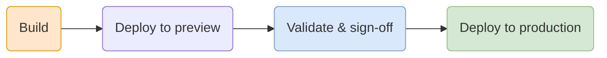
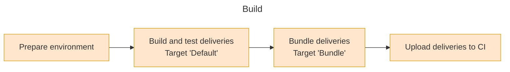
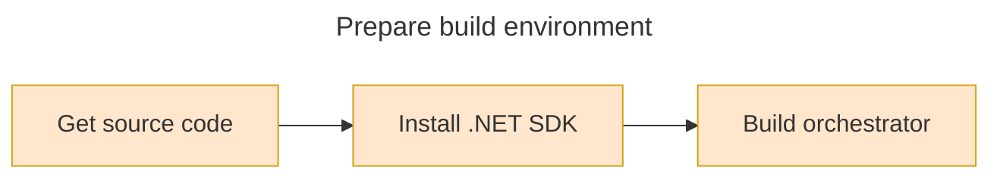
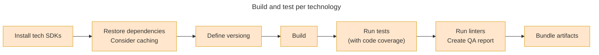
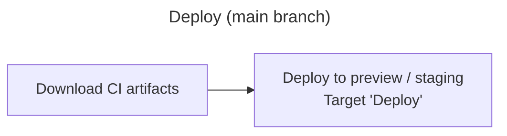
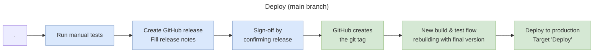
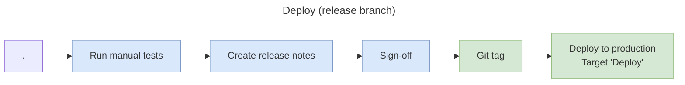

# Pipeline workflows

The process of building to deploy in production a project happens in four
stages:

The continuous integration pipeline will run our _build orchestrator_ targets.
The build system does everything needed except setting up the build environment.

## Build

This stage happens for every type of build. Here we build all the deliveries and
run automated tests. This is the core of the build system that developers will
run locally as well as to validate pull requests.

### Prepare environment

Setting up the building environment involves:

In most projects the steps to setup a dev environment are simple and the cost of
automatizing may be larger. Consider this new technologies for it:

- [VS Code dev containers](https://code.visualstudio.com/docs/devcontainers/containers)
- [Windows dev drives](https://learn.microsoft.com/en-us/windows/dev-home/)
- [GitHub codespaces](https://github.com/features/codespaces)

### Build and test deliveries

The process of building and testing should be provided by the build system. The
process is usually very similar for each technology or project delivery type.
Consider implementing these steps for each delivery: .NET, Node.JS, DocFX docs,
MSI installers, ...

> [!TIP]  
> You may want to skip some steps if you repeating the process on multiple
> platforms (e.g. testing cross-platform). For instance you may want to bundle
> only from one platform but run the tests in all of them.

## Deploy

This stage only happens for _preview_ and _stable_ builds. From the proposed
[git flow](./gitflow.md) this means that it starts when there are new commits in
the _main_ and _release_ branch (if used).

## Simple release variant

On small projects we can skip having a release branch at the expense of having
to **re-build** the project. We can have a simple workflow from GitHub as
follow:

## Release branch variant

If the build is happening from a [release branch](./gitflow.md#release-branches)
then it's a _release candidate_, a potential stable build. The pipeline then
blocks waiting for the user approval before resuming deploying to production.

The step to create release notes and sign-off may be different depending the
project requirements. Some strategies:

- **GitHub**: it provides a way to _create releases_ with its release notes.
  _PleOps Cake_ provides
  [tasks to export the release notes](../recipe/github.md#export-release-notes)
  from the current _GitHub Release_. This allows to use the feature of GitHub to
  generate them automatically and then adjust manually. You can also use it as a
  _sign-off_:
  1. Run the build pipeline and validate the artifacts.
  2. Create a GitHub release with the desired version number. Fill the release
     notes.
  3. Confirming the GitHub release will create a git tag, triggering the build
     pipeline.
  4. This pipeline will detect it's building from a git tag, deploying this time
     to production feeds.
  - Consider reviewing
    [GitHub Actions manual approvals](https://docs.github.com/en/actions/managing-workflow-runs/reviewing-deployments)
- **Azure DevOps**: it provides a
  [_manual approval_ task](https://learn.microsoft.com/en-us/azure/devops/pipelines/tasks/reference/manual-validation-v0?view=azure-pipelines).
  The workflow would be then:
  1. Create the release notes documents as part of the development work (on each
     PR).
  2. The pipeline from release branches will finish with a _manual approval
     task_.
  3. Run tests and approve the task once it's ready.
  4. The pipeline will continue deploying to production.

> [!TIP]  
> One interesting design goal we should achieve is the ability to deploy in
> production **without rebuilding the project**. That is, the binaries we deploy
> are exactly the same we have tested and approved. This has several
> implications that affects the git flow and versioning. The proposed
> [versioning](./versioning.md) and [git flow](./gitflow.md) (**when using a
> release branch**) support this scenario.

<!-- -->

> [!TIP]  
> If you use Azure DevOps, consider **retaining** your build and release
> pipeline for traceability.
