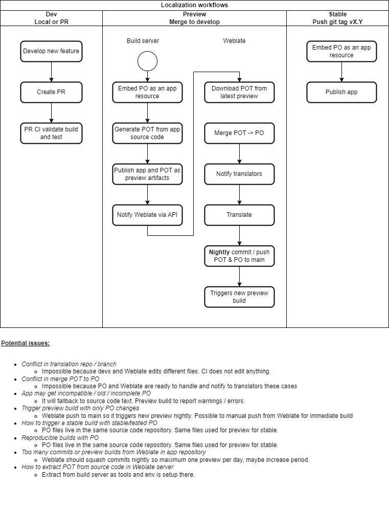

# Translation workflow

> [!NOTE]  
> This is an initial design of how a translation workflow could work. It has not
> been implemented or tested yet.

A _translation workflow_ would allow to translate applications during the
development lifecycle in an _agile_ way.

As the developers code the software and _hard-code_ strings in a source language
(usually English), translators could translate into several languages
translation files and contribute back to the repository, so every build includes
the translations as well.

