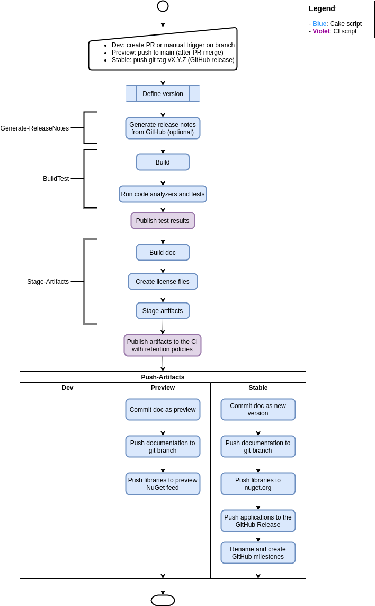

# .NET DevOps Pipeline

Full automated build, test, stage and release pipeline for .NET projects based
on Cake. Check also the
[template repository](https://github.com/pleonex/template-csharp) to see the
pipeline in action!

<!-- prettier-ignore -->
| Release | Package                                                           |
| ------- | ----------------------------------------------------------------- |
| Stable  |  |
| Preview | [Azure Artifacts](https://dev.azure.com/benito356/NetDevOpsTest/_packaging?_a=feed&feed=PleOps) |

## Requirements

- .NET 5.0 SDK
- .NET Core 3.1 runtime

## Build system command

The following target are available for build, test and release.

- `BuildTest`: build the project and run its tests and quality assurance tools.

- `Generate-ReleaseNotes`: generate a release notes and full changelog by
  analyzing issues and PR of GitHub.

- `Stage-Artifacts`: run `BuildTest`, generate the release notes, build the
  documentation, pack the libraries in NuGet and stage the executables.

- `Push-Artifacts`: push the libraries, applications and documentation to the
  preview or stable feed.

## Documentation

Check the [Pipeline Workflow](./guides/spec/PipelineWorkflow.md) document to
learn how the build system works. Also don't miss the
[Project Setup](./guides/Project%20setup.md) to learn how to start using this
build system.

For reference, this is the general build and release pipeline:

